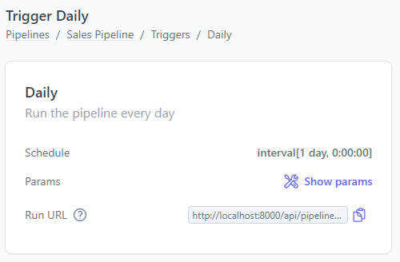

A trigger is the entrypoint to run a pipeline, it can be a schedule or an external
event and eventually has input parameters associated to it, if the pipeline has
declared any parameter.

## Pipeline trigger

When you register a pipeline, you're not obliged to add triggers. By default
the system will add a *pipeline trigger* to let you run the pipeline
without any additional effort.

The pipeline trigger results in a button on the web UI and an HTTP endpoint
which you can use to run the pipeline.

### HTTP trigger

The HTTP trigger allows you to run the pipeline via an HTTP
`POST` call. If you open a pipeline page you'll find the trigger URL:

<figure markdown>
  
  <figcaption>URL to run the pipeline programmatically via an HTTP POST request</figcaption>
</figure>

### Manual trigger

{align=right}

The web UI features a *manual run* button (which is based on the HTTP trigger).
You will find this button in the home page and in the pipeline page.

### With parameters

If the pipeline has input parameters, when you click the manual run button,
the dialog will present a form to let you customize the input parameters:

<figure markdown>
  
  <figcaption>Manual run with parameters</figcaption>
</figure>

The input form in the dialog is created automatically thanks to the Pydantic's
`BaseModel` that you declared in the pipeline.

Parameters are configurable also when you run a pipeline via the HTTP trigger,
just pass the parameters as JSON body in the HTTP request.


## Schedules

Scheduling a pipeline is probably the first thing you're looking for
when using Mario Pype. It's very easy, just add 1 or more triggers
when registering a pipeline, (the `triggers` argument must be a list
even if you only have 1 trigger).
The actual schedule is defined via the `schedule` argument:

```py hl_lines="1 7-15"
from apscheduler.triggers.interval import IntervalTrigger
from mario import register_pipeline, Trigger

register_pipeline(
    id="sales_pipeline",
    tasks=[get_sales_data],
    triggers=[
        Trigger(
            id="daily",
            description="Run the pipeline every day",
            schedule=IntervalTrigger(
                days=1,
            ),
        ),
    ],
)
```

`schedule` accepts any APS trigger, at the moment the following schedules/APS triggers are available:

* [`CronTrigger`](https://apscheduler.readthedocs.io/en/3.x/modules/triggers/cron.html#module-apscheduler.triggers.cron){target=_blank}
* [`DateTrigger`](https://apscheduler.readthedocs.io/en/3.x/modules/triggers/date.html#module-apscheduler.triggers.date){target=_blank}
* [`IntervalTrigger`](https://apscheduler.readthedocs.io/en/3.x/modules/triggers/interval.html#module-apscheduler.triggers.interval){target=_blank}
* [`Combining`](https://apscheduler.readthedocs.io/en/3.x/modules/triggers/combining.html#module-apscheduler.triggers.combining){target=_blank}

## Triggers with parameters

Adding triggers to a pipeline is not useful only for scheduling purposes,
but also for definign *alternative* entrypoints to run a pipeline with
custom parameters.

If a pipeline has input parameters, then its triggers can have custom parameters:

```py hl_lines="3-5 13 21-24"
from pydantic import BaseModel

class InputParams(BaseModel):
    past_days: int
    convert_currency: bool = False

def get_sales_data(params: InputParams):
    print(params.past_days)

register_pipeline(
    id="sales_pipeline",
    tasks=[get_sales_data],
    params=InputParams,
    triggers=[
        Trigger(
            id="daily",
            description="Get last 5 days of sales data in USD dollars",
            schedule=IntervalTrigger(
                days=1,
            ),
            params={
                "past_days": 5,
                "convert_currency": True,
            },
        ),
    ],
)
```

In the triggers page you'll find info about the trigger, including its
URL and its parameters.

<figure markdown>
  
  <figcaption>Trigger info, in the trigger page</figcaption>
</figure>


Be aware that you cannot customize the input parameters when running a trigger
(manually or via HTTP), so be sure to provide a valid object
in the trigger's `params` argument.

{align=right}

Indeed when you click the *Run trigger* button, there will be no dialog to
confirm the run or customize the parameters.


!!! info "Why?"

    This is a design choice. A trigger is by definition a well-defined entrypoint
    that could run without human intervention, that is via a schedule, and to have
    consistent runs of the same trigger either via a schedule or via a UI button,
    the trigger must be *immutable*.

For example, based on the previous code, you can't declare the trigger like this,
because `past_days` is missing but it's mandatory in `InputParams`:

```py
Trigger(
    # ...
    params={
        "convert_currency": True,
    }
)
```
Though you can omit optional values, so this would be valid:

```py
Trigger(
    # ...
    params={
        "past_days": 3,
    }
)
```

If you have a complex input parameters model, it's very useful to declare several triggers,
without a schedule, just to have clear entrypoints for a user that wants to run the pipeline
manually and doesn't know much about the code.
